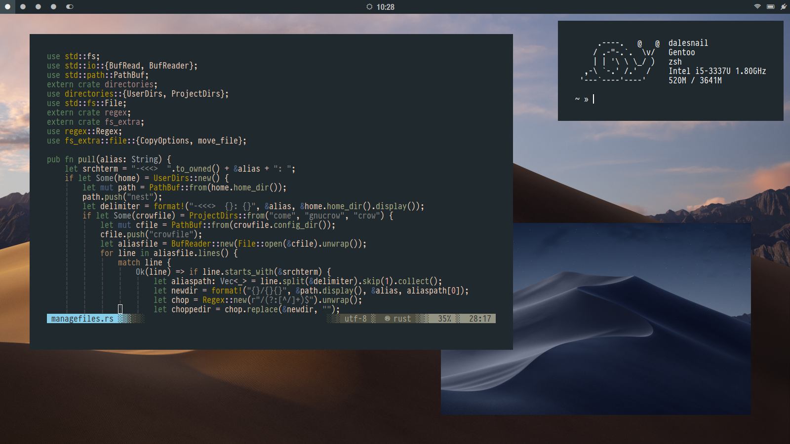
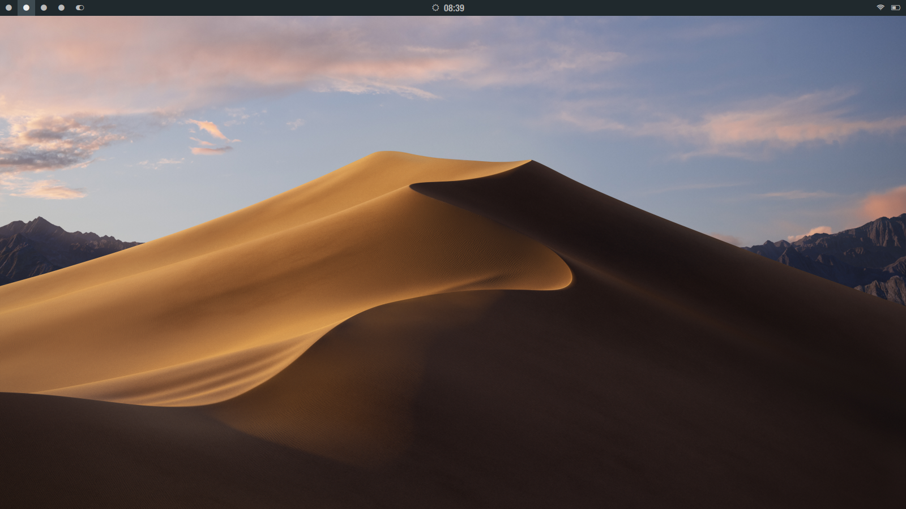
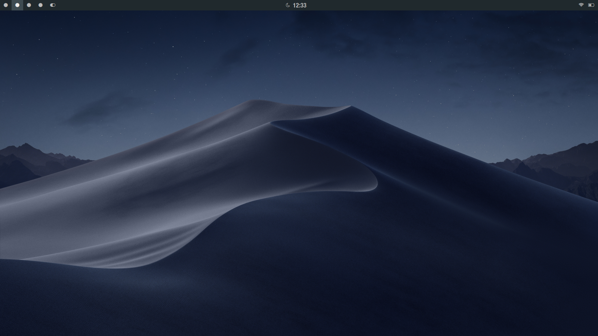

🌑🌑🌑

Maintained with GNU Stow && [crow](https://github.com/dalesnail/crow/releases)

### Current screenshot of the config (7/5/2019)

### Status bar will change teh background and clock icon depending on the time of day. 
---
## Daytime

## Nightime 

